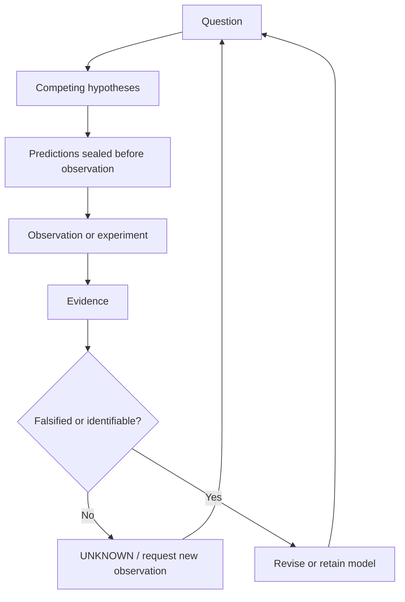

Scientific OS is an internal research workflow for moving from a question to competing hypotheses, sealed predictions, evidence, diagnosis, model revision, and the next observation. It keeps `UNKNOWN` and `UNRESOLVED` as valid outputs when the available evidence cannot identify an answer.

This public repository does **not** demonstrate that Scientific OS autonomously produces correct science, improves itself, or transfers across real-world domains. Each public note stands or falls on its own evidence and reproduction path.

