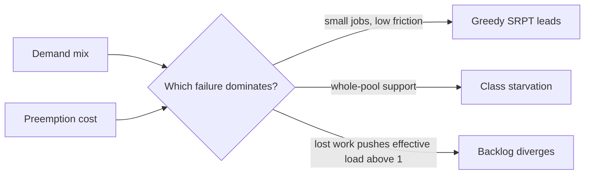
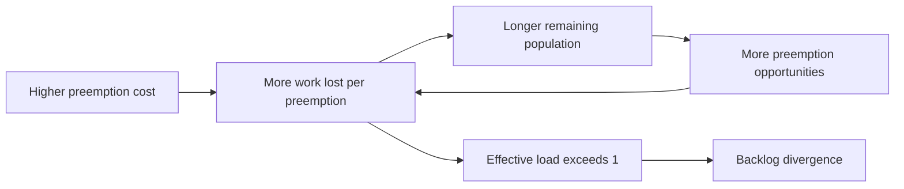

<p class="research-area"><b>GPU cluster scheduling</b><span>Where this line of work started (EP-0001)</span><a href="/ja/research/gpu-scheduling/" hreflang="ja">日本語</a></p>

<div class="evidence-strip"><span>Finding</span><span>Synthetic simulation</span><span>Exploratory</span><span>Not peer reviewed</span><span>0 external replications</span></div>

> **Later work narrows two claims in this note.** [[en/research/gpu-scheduling-phase-diagram/index|EP-0002]] found that the estimation-error conclusion below depends on the noise parameterization, and that the greedy-SRPT result holds only for demand mixes without whole-cluster jobs. [[en/research/gpu-scheduling-starvation-mechanism/index|EP-0003]] isolated the cause. This note is kept as the record of what was claimed on 2026-09-13 and is not edited.

## Current finding

A GPU scheduler decides which job runs next. In theory, running the shortest remaining job first minimises mean completion time. Production adds two frictions: job durations are not known exactly, and preempting a running job throws away the work it had already done.

With both frictions in a 64-slot synthetic cluster, **there was no single best rule**. Greedy SRPT led on a small-job-heavy mix at low friction. On a gang-heavy mix — jobs asking for 32 or 64 GPUs at once — greedy SRPT diverged while ServerFilling-SRPT stayed stable.

The surprise was which friction decided it. **Within the range tested, estimation noise alone never reversed greedy SRPT against EASY backfill.** Restart cost did. At a preemption cost of 0.2, discarded work accumulated until effective load exceeded capacity and the backlog diverged.

These are simulation findings, not evidence from production traces. Read the notice above and the three later studies before transferring anything here into practice.

## Key figure



## What this research shows

- Policy rankings in the declared simulator depend on workload support and preemption friction.
- Ten sealed predictions graded 7/10, with failed and ill-posed predictions retained.

## What this research does not show

- It does not identify the current real-cluster boundary; EP-0004 later measured that question.
- It does not establish production superiority, fairness, or a universal crossover.

## Research question

Where do size-estimation error `sigma` and preemption cost `c_pre` reverse the ranking of greedy SRPT and ServerFilling-SRPT against FCFS plus EASY backfill, and how does that boundary depend on GPU-demand mix?

## Why this matters

A mean-completion-time ranking can hide a more important distinction: one policy may remain stable while another starves a demand class or accumulates backlog. Production schedulers face both uncertain size estimates and non-zero restart/checkpoint cost, so an idealized ranking should not be transferred without testing the stability boundary.

## Competing hypotheses

- **H1 — theory robust:** size-based priority remains useful under the tested estimation error.
- **H2 — information fragile:** estimation error alone reverses the ranking.
- **H3 — preemption-cost dominant:** repeated lost work changes effective load and can reverse stability.
- **H4 — mix dominant:** large gang demand creates fragmentation/starvation behavior that changes which scheduling principle is viable.

## Predictions

Ten predictions were sealed before E1. The prediction JSON had SHA-256 `dd977a92c0edf7472a6190d35dab7baa22743375627ca326be354d4c4eda4b01` and was fixed in source commit `a66c492` before result artifacts existed.

| Prediction | Criterion | Result |
|---|---|---|
| P1 | SRPT/EASY mean JCT < 0.95 at `sigma=1,c=0` | Supported: 0.659 |
| P2 | SRPT still beats EASY at `sigma=2,c=0` | Supported: 0.909 |
| P3 | SRPT loses to EASY at `c=0.2,sigma=0` | Supported: SRPT diverged |
| P4 | SRPT/EASY crossover lies between `c=0.05` and `0.2` | Supported: 0.794 then divergence |
| P5 | ServerFilling-SRPT beats SRPT for gang-heavy, `c=0.2` | Supported: ratio 0.129 |
| P6 | ServerFilling/SRPT lost-work ratio > 1.5 in every friction cell | **Failed:** one cell was 1.25 |
| P7 | Estimation error degrades ServerFilling-SRPT less in gang-heavy | **Failed / ill-posed:** baseline SRPT diverged in every cell |
| P8 | EASY changes by less than 15% from `sigma=0` to `2` | **Failed:** 16.2%, non-monotonic |
| P9 | FCFS is invariant to unused friction parameters | Supported: 0.00% deviation |
| P10 | Gang-heavy FCFS backlog grows in every cell | Supported: 4/4 |

Score: **7/10 supported**. P7 also exposed a design error: a performance-degradation prediction was written without first requiring both compared systems to be stable.

## Method

- 64 identical GPU-server slots; multi-server jobs request multiple slots simultaneously.
- Exponential service duration, mean 1.0; offered load `rho=0.85`.
- 30,000 jobs per cell, 20% warm-up, five fixed seeds.
- Policies: FCFS, EASY backfill, greedy SRPT, ServerFilling-SRPT.
- `sigma in {0,0.5,1,2}` and `c_pre / E[S] in {0,0.05,0.2}`.
- Two synthetic demand mixes: a small-job-heavy mix with internal scenario ID `trace_like`, dominated by 1-GPU jobs, and `gang_heavy`, dominated by 32/64-GPU jobs. The name `trace_like` does not mean that production trace data were used.
- 320 E1 runs; long-horizon adjudication separated stable queues from growing backlog.

Before E1, the simulator was checked against M/M/c, Little's law, work conservation, a pooled-SRPT lower bound, and the ServerFilling selection rule.

## Results

### The mix changed the winning principle

For the small-job-heavy synthetic mix (internal ID `trace_like`), zero-cost greedy SRPT had mean JCT 1.13 at `sigma=0`, versus 1.35 for ServerFilling-SRPT and 1.58 for EASY. At `sigma=2`, greedy SRPT remained ahead of EASY: 1.20 versus 1.33.

For `gang_heavy` at zero friction, greedy SRPT diverged while ServerFilling-SRPT remained stable with mean JCT 3.54. Greedy SRPT gave 64-GPU jobs mean JCT 71.5, about 48 times its 8-GPU-job value; ServerFilling-SRPT reversed that class ordering and gave 64-GPU jobs mean JCT 2.3.

### Preemption cost changed stability, not just average latency

In the same small-job-heavy synthetic mix, greedy SRPT's preemptions per job rose from 0.62 at zero cost to 1.99 at cost 0.2. Lost work reached 40%, giving `rho_eff = 0.85 * (1 + 0.40) = 1.19`. Long-horizon backlog slope did not shrink. ServerFilling-SRPT at cost 0.2 also crossed effective capacity in this mix.



## What changed

- We dropped the rule “use the theoretically optimal size-based policy.” Its advantage was conditional on demand mix and friction.
- We did not adopt “size estimation error is the main weakness” within this tested grid. Preemption cost was the measured failure mechanism.
- We stopped treating saturation utilization alone as a stability boundary because class starvation can coexist with aggregate utilization near one.

## What failed

Three simulator/analysis defects were found before E1:

1. Preempted jobs could disappear from the waiting set, making mean JCT look artificially good.
2. A proposed “FCFS must have low utilization” calibration rule was conceptually wrong in a stable work-conserving system.
3. Completion fraction could not diagnose divergence after arrivals stopped and the finite system drained.

Failed predictions P6–P8 remain in the public record. P7's criterion was invalid under divergence; P8 revealed a non-monotonic response that may be entangled with the chosen lognormal parameterization.

## Evidence boundary

**Supported:** Under the exact simulator, demand mixes, parameter grid, and seeds, workload mix and preemption cost changed policy ranking; several cells changed from stable to divergent; the sealed predictions graded 7/10.

**Not supported:** This study does not show production-cluster superiority, a universal crossover, robustness to arbitrary duration distributions, fairness acceptability, or external validity. No Blox, Philly, Alibaba PAI, or other real trace has been run.

## UNKNOWN

- Whether an estimation-error-only crossover exists above `sigma=2`.
- Whether results persist with a median-unbiased rather than mean-unbiased lognormal error parameterization.
- The continuous crossover contour across large-gang share and preemption cost.
- Behavior under non-exponential durations, correlated estimates, checkpointing, and placement constraints.
- Real-trace validation.

## Falsification targets

- A real or independent simulator at the same parameters does not reproduce the stable/divergent classifications.
- The long-horizon backlog slope approaches zero in cells labeled divergent.
- A corrected median-unbiased error model reverses the inference about estimation error within the same range.
- Representative real traces do not show the predicted mix-dependent ranking or starvation direction.

## Reproduce

### Quick artifact and calibration check

```bash
python -m pip install -r requirements-reproduce.txt
python scripts/reproduce.py --quick gpu
```

### Full E1 rerun

```bash
cd reproduction/gpu-scheduling
python run_sweep.py
python analyze_e1.py
```

The public package is pinned to the E1 result commit `6e96d5f`. Later, unadjudicated experiments from the private source repository are intentionally excluded.

## Evidence / Artifacts

- [Public reproduction package](https://github.com/kbmt327-dev/scientific-os-research/tree/main/reproduction/gpu-scheduling)
- [Sealed PRED-001](https://github.com/kbmt327-dev/scientific-os-research/blob/main/reproduction/gpu-scheduling/predictions/PRED-001.json)
- [E1 grading](https://github.com/kbmt327-dev/scientific-os-research/blob/main/reproduction/gpu-scheduling/results/E1_grading.json)
- [E1 result data](https://github.com/kbmt327-dev/scientific-os-research/blob/main/reproduction/gpu-scheduling/results/E1.json)
- Internal source Episode digest: `c72f32f1b4269cf761083cb646ae7cd15d7a82b1a3f4c37a678739094098f1a0`

## External audit

- Independent replications: 0
- Failed replications: 0
- Confirmed bugs after publication: 0
- Open critiques: 0

## Next experiment

Sweep the large-gang share and preemption cost more finely with a median-unbiased error model, then test preregistered representative points on public production traces. Treat stability as a prerequisite before comparing mean JCT.
