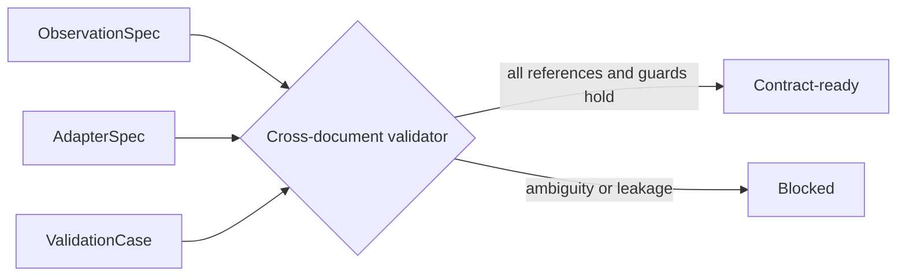

<p class="research-area"><b>Human movement model interfaces</b><span>Making connection assumptions machine-checkable</span><a href="/ja/research/human-model/" hreflang="ja">日本語</a></p>

<div class="evidence-strip"><span>Method</span><span>Contract validation</span><span>Adapter blocked</span><span>Not predictive evidence</span><span>0 external replications</span></div>

> [!note] A later note fixes the dataset boundary
> [[en/research/human-model-dataset-portfolio/index|EP-0005]] separates development, external validation, and internal-load testing. It also makes B3D a source-adapter format and removes Nimble parity from the mandatory next gate. The contract result below is unchanged.

## What this method does

Human Model Contract v0.2 makes ambiguous coordinates, unresolved mappings, broken references, and target leakage block a validation case instead of surviving as prose warnings. One valid bundle passed; seven intentionally invalid variants were rejected.

Contract v0.2 turns coordinate-system identity, adapter references, source inconsistencies, and target leakage into machine-checkable requirements across `ObservationSpec`, `AdapterSpec`, and `ValidationCase`. A positive bundle passed nine classes of checks, while seven deliberately invalid variants were rejected. Earlier v0.1 artifacts remained unchanged so prior evidence hashes were not invalidated. This demonstrates fail-closed contract behavior only; it does not demonstrate correct numerical transforms or human-model predictive performance.

## Key figure



## What this method establishes

The published schema bundle enforces its declared contract-level references, readiness gates, and negative controls.

## What this method does not establish

It does not validate numerical transforms, biomechanical predictions, scientific value, or model promotion. The public adapter remains blocked.

## Research question

Can known mismatches in a public biomechanics sample be represented so that unresolved mappings, coordinate ambiguity, missing references, and target leakage block a validation case mechanically rather than through prose alone?

## Why this matters

Human-model pipelines can appear to run while silently mixing coordinate systems, model bases, processing passes, or outcome-derived inputs. A contract should make those boundary violations explicit before numerical performance is interpreted.

## Method

The public bundle defines:

- **ObservationSpec:** coordinate spaces, channels, processing passes, source consistency checks, and structured warnings.
- **AdapterSpec:** source observation, target model, coordinate/frame references, mapping status, and reviewed warnings.
- **ValidationCase:** exact observation/model/adapter references, inputs, targets, leakage rules, and readiness state.

The validator checks JSON Schema 2020-12 conformance, identifier uniqueness, cross-document references, adapter targets, source warnings, leakage rules, and the readiness gate.

## Results

The baseline bundle passed nine check groups. Seven negative controls were rejected:

1. missing `coordinate_spaces`;
2. unknown channel coordinate reference;
3. missing `adapter_ref`;
4. adapter/ValidationCase observation mismatch;
5. removed source-inconsistency warning;
6. `ready` state with unresolved mappings;
7. a dynamics/force-derived target channel inserted as input.

## What changed

The method shifted from overwriting v0.1 files to versioned v0.2 schemas and examples. That preserves previous artifact hashes and makes the semantic change auditable.

## What failed

The source sample exposed a mismatch between 37 active degrees of freedom and 39 embedded coordinates. The contract records the inconsistency but cannot decide which representation is correct. The public example therefore remains blocked instead of converting ambiguity into an adapter claim.

## Evidence boundary

**Supported:** The included public schemas, examples, cross-document validator, and negative controls enforce the stated contract-level rules.

**Not supported:** Nimble/OpenSim execution, B3D numerical frame transforms, correctness of a 37-to-18-DOF mapping, biomechanics prediction, scientific value, or model promotion.

## UNKNOWN

- Whether the same B3D content is read consistently through the official Nimble API and the inspected protobuf path.
- The correct resolution of active-DOF versus embedded-coordinate counts.
- Numerical validity of frame and basis transforms.
- Whether a valid mapping to the target model can be constructed without missing racket state.

## Falsification targets

- Any negative control above is accepted.
- A `ready` ValidationCase can reference an unresolved adapter.
- A target-derived dynamics channel can enter inputs without rejection.
- Official API inspection contradicts the public source metadata or coordinate assumptions.

## Reproduce

```bash
python -m pip install -r requirements-reproduce.txt
python scripts/reproduce.py --quick human
```

The public bundle is privacy-sanitized: machine-local documentation paths in one internal example were converted to repository-relative references. The validator and scientific boundaries are unchanged; public artifact hashes are recorded separately.

## Evidence / Artifacts

- [Schemas, examples, validator, and evidence](https://github.com/kbmt327-dev/scientific-os-research/tree/main/reproduction/human-model-contract)
- Internal source Episode digest: `260f10d6b70d75420e9aa57945ca24cd7d0335eaed053cf5a0fe9f77008f90f8`

## External audit

- Independent replications: 0
- Failed replications: 0
- Confirmed bugs after publication: 0
- Open critiques: 0

## Next experiment

Read an identical public B3D artifact through an official Linux/Nimble environment, compare header/trial/pass/frame/missing-GRF metadata to the current extraction, and retain the adapter as blocked if any required mapping remains unresolved.
