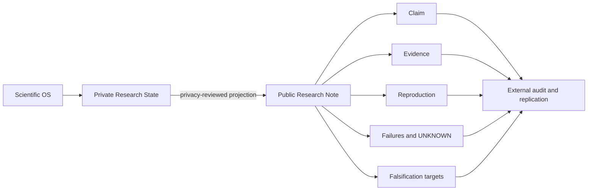

> **Research conducted by Scientific OS — published for reproduction, audit, challenge, and extension.**

This is an open research lab powered by Scientific OS. Research is published with its hypotheses, evidence, failures, uncertainties, and reproduction paths. Claims are provisional unless independently replicated. Critique, replication, and falsification are welcome.

  
<strong>Reproduce</strong>Run the code or follow the protocol.

  
<strong>Audit</strong>Trace claims to evidence and sealed predictions.

  
<strong>Falsify</strong>Target the conditions that would weaken a claim.

  
<strong>Keep UNKNOWN</strong>Do not convert missing evidence into confidence.

## Current research

| Research Note | State | Evidence boundary |
|---|---|---|
| [[research/gpu-scheduling/index\|Scheduling principles reverse under workload mix and preemption friction]] | `Finding` · `Synthetic` · `Exploratory` | Simulator validated against analytic and conservation checks; no real trace validation. |
| [[research/simulation-worlds/index\|Blind identification of batched arrivals and heterogeneous servers]] | `Finding` · `Synthetic blind benchmark` | Hidden instance recovered inside a known mechanism family; not open-world discovery. |
| [[research/human-model/index\|Human Model Contract v0.2]] | `Method` · `Contract validation` | Fail-closed schema and cross-document checks; no human-model predictive performance. |
| [[research/badminton-biomechanics/index\|2×2 preparation-time × backward-CoM protocol]] | `Protocol` · `Not sealed` | Design and power sensitivity only; no confirmatory data. |

## From private research to public evidence

An internal Episode is never replaced by its public projection. See [[about/methodology|methodology]] and [[about/open-research-lab|why the boundary matters]].

## Start here

- **Reproduce a result:** [[contribute/reproduce]]
- **Audit or challenge a claim:** [[contribute/audit]]
- **Collaborate:** [[contribute/collaborate]]
- **Understand evidence labels:** [[methodology/evidence-levels]]
