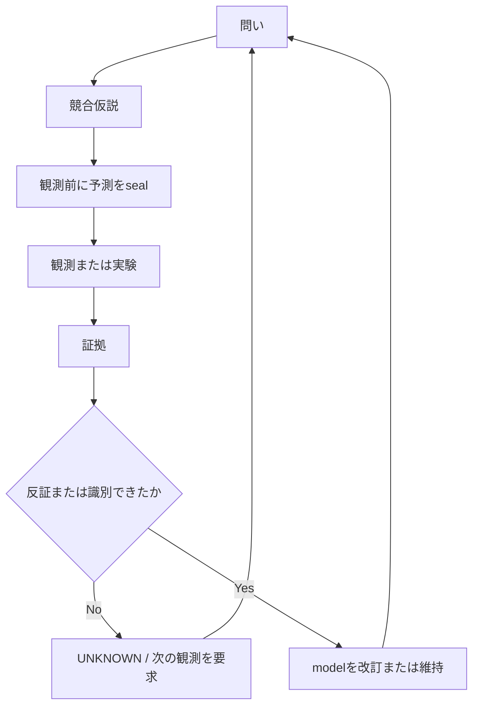

Scientific OSは、問いから競合仮説、封印済み予測、証拠、診断、model改訂、次の観測へ進む内部研究workflowです。証拠から答えを識別できない場合、`UNKNOWN`と`UNRESOLVED`を正規の出力として残します。

この公開repositoryは、Scientific OSが自律的に正しい科学を生み、自己改善し、実世界のdomain間で転移できることを**実証していません**。各Research Noteは、そのnote自身の証拠と再現経路によって評価されます。

