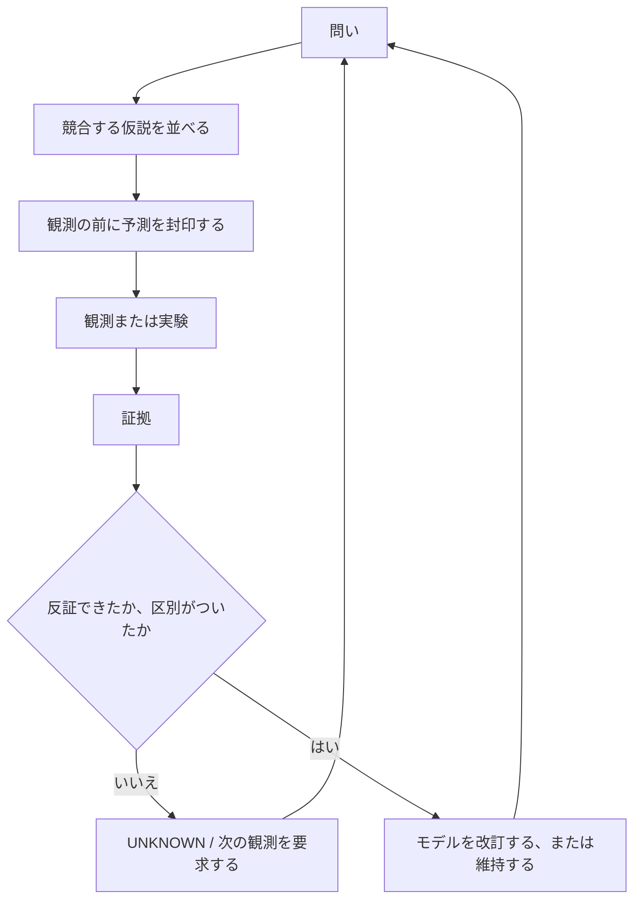

一言でいうと、Scientific OSは**「思いついた説明を、自分に都合よく採用してしまわないようにする」ための手続き**です。

研究でいちばん壊れやすいのは、結果を見た後に「そう思っていた」と理由を作ってしまうところです。そこでこの仕組みは、観測する前に予測を確定してハッシュで固定し（封印）、後から書き換えられないようにします。証拠から答えを決められないときは、無理に結論を出さず `UNKNOWN` と `UNRESOLVED` を正式な出力として残します。

各要素の詳しい読み方は、**[[ja/how-to-read/index|研究の読み方]]** にあります。

## この公開リポジトリが実証していないこと

Scientific OSが自律的に正しい科学を生み出すこと、自己改善すること、実世界の分野をまたいで転移すること——**これらは何一つ実証していません。**

各研究は、その研究自身の証拠と再現手順によってのみ評価されます。仕組みが証拠を整理できることと、主張が正しいことは別の話です。
