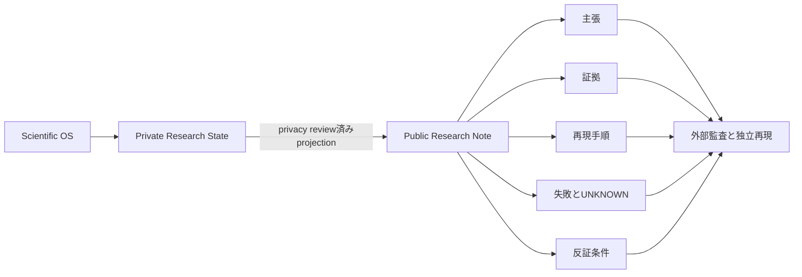

English: <a href="https://kbmt327-dev.github.io/scientific-os-research/">Open Research Lab</a>

> **Scientific OSによる研究を、再現・監査・反証・発展できる形で公開します。**

Open Research Labは、Scientific OSを用いて進めた研究の公開面です。仮説、証拠、失敗、不確実性、再現経路を一緒に公開します。独立再現されるまで主張は暫定です。批判、追試、反証を歓迎します。

  
<strong>再現する</strong>コードを実行するか、公開プロトコルに従う。

  
<strong>監査する</strong>主張を証拠と封印済み予測までたどる。

  
<strong>反証する</strong>主張を弱める条件を具体的に試す。

  
<strong>UNKNOWNを残す</strong>証拠がない箇所を自信で埋めない。

## 公開中の研究

| Research Note | 状態 | 証拠境界 |
|---|---|---|
| [[ja/research/gpu-scheduling/index\|摩擦とworkload mixでGPU schedulingの原理が逆転する]] | `Finding` · `合成simulation` · `探索的` | 解析解と保存則でsimulatorを検算。実traceは未検証。主張2点は後続研究が条件付け。 |
| [[ja/research/gpu-scheduling-phase-diagram/index\|需要mixの相図と、失敗した3つの安定性判定器]] | `Finding` · `合成simulation` · `探索的` | 21セルの安定性相図。再発1件を含む計測器の失敗3件を開示。採点5/10。 |
| [[ja/research/gpu-scheduling-starvation-mechanism/index\|size-based schedulingが壊れる条件は平均gang sizeではなく全クラスタjobの有無]] | `Finding` · `合成simulation` · `探索的` | 平均を一致させた対照群でsupportと平均を分離。実務的含意は後に降格。採点7/10。 |
| [[ja/research/gpu-scheduling-real-traces/index\|実traceにpoolを占め切るjobは来ておらず、飢餓の境界は連続だった]] | `Finding` · `公開trace＋合成` · `探索的` | 取得したのは需要の形のみ。実到着列でpolicyは走らせていない。事前約束による降格を履行。採点5/10と9/10。 |
| [[ja/research/simulation-worlds/index\|バッチ到着と不均質serverを盲検同定する]] | `Finding` · `合成blind benchmark` | 既知の候補機構族内での同定。未知の仮説空間の発見ではない。 |
| [[ja/research/human-model/index\|Human Model Contract v0.2]] | `Method` · `Contract validation` | fail-closed contractの検証。人体モデルの予測性能ではない。 |
| [[ja/research/badminton-biomechanics/index\|バドミントンスマッシュの準備時間×後方CoM 2×2 protocol]] | `Protocol` · `未seal` | 設計とpower感度のみ。確証データはない。 |

## Private researchからpublic evidenceへ

内部Episodeは公開Research Noteで置き換えません。[[ja/about/methodology|公開方法]]と[[ja/about/open-research-lab|公開境界]]を参照してください。

## はじめに

- **結果を再現する：** [[ja/contribute/reproduce]]
- **主張を監査・反証する：** [[ja/contribute/audit]]
- **共同研究を提案する：** [[ja/contribute/collaborate]]
- **証拠ラベルを理解する：** [[ja/methodology/evidence-levels]]
