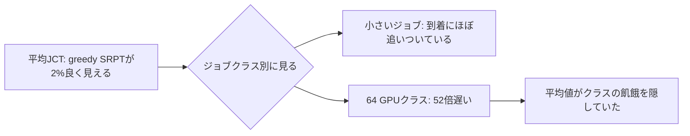

<p class="research-area"><b>GPUクラスタのスケジューリング</b><span>平均値が隠すもの／安定性をどう測るか</span><a href="/en/research/gpu-scheduling-phase-diagram/" hreflang="en">English</a></p>

<div class="evidence-strip"><span>Finding</span><span>合成シミュレーション</span><span>探索的</span><span>査読なし</span><span>外部再現 0</span></div>

## 現在わかっていること

GPUクラスタのスケジューリング研究は、ふつう平均ジョブ完了時間で方式に順位を付けます。この研究は、その順位が肝心なことを測っていない場合があることを示しました。

需要の構成を1本の軸として連続的に動かしたところ、**平均は良いのに特定のジョブクラスだけが到着に追いつけない、という状態が実在しました。** 小さいジョブ中心・rho 0.85では、greedy SRPTの平均JCTは2.06、EASY backfillは2.11です。比0.98で、少しだけ良いふつうの方式に見えます。しかし同じ実行のなかで、64 GPUを要求するクラスの平均JCTは366、EASY backfillでは7.1でした。**52倍の差が、平均値の中に隠れていました。**

もう一つ、前の研究の結論が一つ引っくり返りました。推定誤差の与え方を、平均を合わせる形から中央値を合わせる形に直すと、**容量を予約する唯一の方式であるEASY backfillが3.3倍悪化しました。** [[ja/research/gpu-scheduling/index|EP-0001]]の「推定誤差はあまり効かない」という結論は、誤差モデルの作り方に依存していたことになります。鈍いのは優先度型のほうでした。

ただし、この研究のより大きな結果はスケジューリングではなく**測り方**の側にありました。「安定か発散か」を一つの観測長だけで判定する検出器が、3回続けて失敗しました。2回目は、このプロジェクトが一度「無効」と記録したはずの検出器が、次の解析スクリプトの中で復活していたものです。封印した10本の予測は、直した判定器では5本、実際に走らせた時点の判定器では4本が的中しました。

## 図で見る



## この研究が示すこと

- この格子の上では、平均完了時間を比べる前に、まず安定しているかどうかを検査する必要がある。
- 中央値を合わせたノイズのもとでEASY backfillは3.3倍悪化し、この方式に関するEP-0001の「推定誤差は効かない」という読みは反転した。

## この研究が示さないこと

- 運用クラスタでの相境界や、観測長が無限のときの安定性を確実に判定する方法は示しません。
- 4本の予測の採点は、結果を見た後に直した判定器に依存します。その4本は証拠としての重みが下がります。

## なぜ重要か

あるジョブクラスが永久に終わらないのに全体の平均は健全に見えるなら、その順位は運用者が気にする量を測っていません。各条件を平均応答時間ではなく**安定しているかどうか**で標識した相図は、速度向上の表とは別のものです。原理を採用する前に実務家が必要とするのは前者です。

測り方の側は、待ち行列系のシミュレーション研究全般に効きます。主張している「安定性」は観測長が無限のときについての言明であり、試した有限の窓での代理指標は、すべて沈黙するか誤るかのどちらかでした。

## 何を調べたか

1. 需要の構成を連続的に動かしたとき、ServerFilling-SRPTはどこでgreedy SRPTを上回るか。その閾値は負荷で動くか。
2. EP-0001の「推定誤差はほとんど効かない」という結果は、sigmaが大きいほど中央値の推定が縮んでしまう「平均を合わせた対数正規誤差」の副産物ではなかったか。

## 方法

需要の構成を1パラメータの族として表しました。64サーバのクラスタで、必要GPU数1〜64に対して `P(need = 2^i)` が `theta^i` に比例するようにします。`theta = 0.4` は小さいジョブ中心で平均ジョブ幅2.37、約60%が1 GPUジョブです。運用トレースについて報告されている形に似せて選びましたが、**この研究のどこでも実トレースのデータは使っていません**。`theta = 2.0` は大きいジョブが支配的で、平均ジョブ幅は43です。

- **E2**：構成7点 × 負荷3点（rho 0.7、0.85、0.95）× 方式4種 × シード5本、各30,000ジョブ。420回の実行。
- **E3**：平均を合わせた誤差と中央値を合わせた誤差、sigma ∈ {0, 0.5, 1, 2, 3}、方式3種、シード5本、`theta = 0.4`・rho 0.85。150回の実行。
- **裁定**：一つの観測長では判定が確定しなかった59セルを、30,000ジョブと120,000ジョブで再実行。236回。

予測はSHA-256 `d726c5a701367f3be0bff47eba10267ee5fcd43bc4b830ec70c97a22477ed8a0` で封印し、結果ファイルが存在しない状態でコミットしました。

## 結果

相図は21セルです。`.` 安定、`S` あるジョブクラスが飢餓、`O` 系全体が過負荷、`X` 測定不能、`?` 裁定不能。

| rho | theta | FCFS | EASY backfill | greedy SRPT | ServerFilling-SRPT |
|---|---|---|---|---|---|
| 0.70 | 0.4 | . | . | **S** | . |
| 0.70 | 0.8 | X | . | O | . |
| 0.70 | 1.25 | O | . | . | . |
| 0.70 | 2.0 | . | . | . | . |
| 0.85 | 0.4 | . | . | **S** | . |
| 0.85 | 0.8 | X | . | O | . |
| 0.85 | 1.6 | O | . | O | . |
| 0.85 | 2.0 | O | . | ? | . |
| 0.95 | 0.4 | X | . | **S** | . |
| 0.95 | 1.0 | X | . | O | . |
| 0.95 | 2.0 | O | . | O | . |

ServerFilling-SRPTとEASY backfillは21セルすべてで安定でした。greedy SRPTが安定したのは3セルだけで、いずれもrho 0.7かつ大きいジョブの幅が揃っている領域です。全体の格子は `results/E2E3_report.txt` にあります。

**全体の指標は破綻を隠します。** `theta = 0.4`・rho 0.85で、greedy SRPTの平均JCTは2.06、EASY backfillは2.11。比0.98です。同じ実行で64 GPUクラスは366、EASY backfillは7.1で、52倍の差がありました。

**優劣が入れ替わるのは、予想と逆の側でした。** rho 0.7でServerFilling/greedyの比は `theta = 1.25` で0.248、1.6で1.070、2.0で1.169です。逆転した側では、greedy SRPTが7〜17%上回っています。ServerFillingの優位は大きいジョブが多いことから来るのではなく、ジョブ幅の**ばらつき**から来ていました。すべてのジョブが同じ大きさなら、きっちり詰める方式が使える自由度がありません。

**不公平の向きは、方式によって反転します。** rho 0.85で、最も遅いクラスの平均JCTは、greedy SRPTではtheta軸に沿って366から84へ下がり、ServerFillingでは1.6から26.7へ上がります。EASY backfillは7.1〜13.6でほぼ平らで、最悪クラスのJCTでは21セル中19セルで最良でした。

**推定誤差、直したモデルで。** sigmaが純粋なばらつきになる中央値合わせでは、EASY backfillの平均JCTはsigma 0から3で2.107から7.019へ、3.3倍になります。最悪クラスは7.1から43.9です。同じ範囲でServerFilling-SRPTは18%、greedy SRPTは27%しか動きません。

平均合わせのモデルでは、EASY backfillの曲線が単調になりません。sigma 1で9.602に達した後、sigma 3では3.887へ**改善**します。これはスケジューリングではなく算術の効果です。sigma 3では中央値の推定が真の大きさの `exp(-4.5) = 0.011` になり、77%のジョブがほぼ瞬時に終わるように見えます。先頭ジョブの予約時刻が現在時刻へ潰れ、EASY backfillは「入るものは何でも動かす」方式へ退化します。小さいジョブ中心の構成では、その退化がたまたま有利に働きました。

## 何が変わったか

EP-0001の主張を3つ改訂します。

| EP-0001の主張 | 改訂 |
|---|---|
| 小さいジョブ中心の構成ではgreedy SRPTが優位 | 需要分布がクラスタ全体を要するジョブを含まない場合に限る。含む場合はServerFilling-SRPTが平均でも最悪クラスでも上回る |
| 推定誤差はほとんど効かない | 予約型の方式については誤り。EASY backfillは純粋なばらつきで3.3倍悪化する。鈍いのは優先度型のほう |
| 大きいジョブの比率が上がると順位が逆転する | 向きが逆。逆転はジョブ幅が揃っている側にあり、greedy SRPTに有利 |

この研究はEP-0001が挙げた未解決項目を2つ閉じ、EP-0001自身が挙げた反証条件の1つを実際に満たしました。直した中央値合わせの誤差モデルは、同じ範囲の中で推定誤差についての推論を反転させています。

## 何が失敗したか

封印した10本のうち5本が外れました。

| 予測 | 判定基準 | 結果 |
|---|---|---|
| Q1 | theta 0.4と0.8の間に交点がある | **外れ。** 同条件での交点は存在しない。rho 0.85でgreedy SRPTは一度も安定しない |
| Q2 | 交点は負荷で1格子以内しか動かない | **外れ。** rho 0.7でしか定義されない |
| Q3 | 比はthetaについて単調に減少する | **外れ。** rho 0.85で比較できるセルが0個。空虚に成立 |
| Q4 | greedy SRPTはtheta 0.8以下で安定 | **外れ。** theta 0.4から1つのクラスが飢える |
| Q5 | EASY backfillは一度も不安定にならない | 的中。21/21が安定、最悪のflow balanceは0.984 |
| Q6 | FCFSはtheta 0.4で安定、1.0以上で不安定 | 的中。ただし0.4での平均JCTはEASY backfillの38倍 |
| Q7 | EASY backfillは一度も最良にならない | 平均JCTでのみ的中。最悪クラスのJCTでは21セル中19セルで最良 |
| Q8 | 中央値合わせなら、EASY backfillのJCTはsigmaについて単調 | 的中 |
| Q9 | sigma 3でもgreedy SRPTがEASY backfillに勝つ | **外れ。** greedy SRPTがクラスを飢餓させるため比較を保留 |
| Q10 | sigma 3でEASY backfillは中央値合わせのほうが悪い | 的中。7.019 対 3.887 |

Q1からQ4は、同じ一つの原因で外れました。封印した枠組みが「両方の方式がどこかで安定していて、順位を入れ替える」ことを前提にしていたためです。実際にはそうなりません。この枠組みは、EP-0001の結果を一般化しすぎたものでした。

**判定器が3つ失敗し、うち1つは再発でした。**

| 判定器 | 壊れ方 | 見つけた時期 |
|---|---|---|
| 完了率が閾値を下回る | 有限の系は到着が止まれば必ず捌けきるので、決して発火しない | EP-0001 |
| 使用率が提供負荷を下回る | 安定した系の長い過渡でも発火する。EP-0001で無効と記録したのに、E2の解析スクリプトの中で復活していた | EP-0002 |
| クラス別flow balanceの**水準** | 観測長に依存する。FCFSのtheta 0.4は30,000ジョブで0.80、120,000ジョブで0.95に上がり、平均JCTは3分の1に下がる（安定）。theta 2.0ではより高い0.87なのに平均JCTが3.22倍になる（発散） | EP-0002 |

較正に耐えたのは、flow balanceの**クラス間の開き**だけでした。飢えているクラスは0.4付近に座り、他のすべてのクラスは1.00に座ります。この符号は観測長を変えても変わらず、同時に飢えているクラス自身のJCTは観測長に比例して伸びます。水準による判定は、2つの観測長での再実行に委ねました。

**開示。** 判定器は結果を見た後に変更しています。PRED-002は両方のセルが安定であることを条件にしていましたが、「安定」の判定式そのものを固定していませんでした。実行時点の判定器では4本、直した後では5本が的中で、Q1・Q2・Q3・Q9の採点はどちらを使うかに依存します。この4本は証拠としての重みを下げます。両方の採点は `results/E2E3_grading.json` の `pass` と `pass_asrun` に保存しました。再発を防ぐため、PRED-003では判定器そのものを封印ファイルの中に書き込んでいます。

## 証拠の範囲

**言えること：** このシミュレータ、需要構成の族、負荷の格子、シードの下で、方式の**安定性**（順位だけでなく）が需要の構成に依存すること。greedy SRPTが小さいジョブ中心の領域全体でクラスタ全体クラスを飢餓させること。全体の平均がその飢餓を隠すこと。EP-0001の推定誤差についての結論が、ノイズの与え方に依存すること。

**言えないこと：** 運用クラスタについての主張、普遍的な閾値、指数分布でないサービス時間での結果、公平性の許容判断、実トレース。この研究では再実行コストは全体を通じて0です。

## まだ分からないこと

- sigma 3を超える領域での挙動。
- 構成依存の交点が、再実行コストが0でなくても残るか。
- サービス時間が重い裾を持つときも、逆転の線が残るか。
- theta 2.0・rho 0.85のgreedy SRPTは裁定不能。観測長を4倍にして1.46倍成長し、安定と発散の帯の間にあります。
- 実トレースでの検証。最優先の未解決項目です。

## この結論が崩れるとき

- 独立に実装したシミュレータが、同じパラメータで安定／飢餓／過負荷の標識を再現しない。
- 観測長をさらに延ばすと、飢えているクラスのJCTが伸びなくなる。
- 3つ目の観測長で、現在「安定」と標識したセルが過負荷側へ動く。
- EASY backfill以外の予約型方式が、中央値合わせの誤差に鈍いと分かる。その場合、推定誤差についての改訂は「予約」という仕組みではなく1つの実装に限られます。

## 自分で確かめる

### データと採点の簡易確認

```bash
python -m pip install -r requirements-reproduce.txt
python scripts/reproduce.py --quick gpu-phase
```

### 完全な再実行

```bash
cd reproduction/gpu-scheduling-phase
python calib/c06_flow_balance.py
python run_e2e3.py
python adjudicate.py
python analyze_e2e3.py
```

先に判定器を較正してください。`c06` が失敗するなら、このパッケージのどの判定も信頼できません。`adjudicate.py` は `analyze_e2e3.py` より前に実行する必要があります。後者は、裁定されていないセルを安定として扱うことを拒否します。

## 証拠とデータ

- [公開再現パッケージ](https://github.com/kbmt327-dev/scientific-os-research/tree/main/reproduction/gpu-scheduling-phase)
- [封印済みPRED-002](https://github.com/kbmt327-dev/scientific-os-research/blob/main/reproduction/gpu-scheduling-phase/predictions/PRED-002.json)
- [E2/E3の採点（実行時点の判定器による採点も保存）](https://github.com/kbmt327-dev/scientific-os-research/blob/main/reproduction/gpu-scheduling-phase/results/E2E3_grading.json)
- [59セルの2観測長裁定](https://github.com/kbmt327-dev/scientific-os-research/blob/main/reproduction/gpu-scheduling-phase/results/adjudication.json)
- [判定器の較正](https://github.com/kbmt327-dev/scientific-os-research/blob/main/reproduction/gpu-scheduling-phase/calib/c06_flow_balance.py)
- 内部の元Episodeのハッシュ：`656775b68fee9214ef5490de02441111ac1451b4f24cab4d00556716c52649f4`

## 外部からの検証

- 独立再現：0
- 再現失敗：0
- 公開後に確認されたbug：0
- 未解決の批判：0

## 次の実験

飢餓の原因として考えられる2つを切り分けます。原因は、必要GPU数の分布がクラスタ全体の大きさまで届いていることか、それとも平均ジョブ幅か。それが[[ja/research/gpu-scheduling-starvation-mechanism/index|EP-0003]]で、平均ジョブ幅を固定したまま、分布の届く範囲だけを動かします。

## ここに至るまで

<div class="revision-chain vertical" aria-label="GPUクラスタのスケジューリング研究の更新履歴">
  <a href="/ja/research/gpu-scheduling/"><b>EP-0001</b><span>推定誤差と再実行コストで、最良の方式が入れ替わる。</span></a>
  <a class="current" href="/ja/research/gpu-scheduling-phase-diagram/"><b>EP-0002 · 現在地</b><span>平均は良いのに、一部のジョブクラスが終わらない。安定性の判定器も3回壊れた。</span></a>
  <a href="/ja/research/gpu-scheduling-starvation-mechanism/"><b>EP-0003</b><span>飢餓を決めるのは平均ジョブ幅ではなく、クラスタ全体を要するジョブの有無。</span></a>
  <a href="/ja/research/gpu-scheduling-real-traces/"><b>EP-0004</b><span>実測したプールにその条件はなく、害は飢餓ではなく数倍の遅れだった。</span></a>
  <a href="/ja/research/gpu-scheduling-pool-size/"><b>EP-0005</b><span>安全境界はプールが大きいほど下がる。実規模の害は2倍過小評価だった。</span></a>
  <a href="/ja/research/gpu-scheduling-concurrency/"><b>EP-0006</b><span>効いていたのはプールの大きさではなく、同時に取り合うジョブの本数だった。</span></a>
  <a href="/ja/research/gpu-scheduling-real-cluster-position/"><b>EP-0007</b><span>実クラスタの位置で測り、4本ぶん載せてきた機構説明を訂正した。</span></a>
  <a href="/ja/research/gpu-scheduling-headline-broken/"><b>EP-0008</b><span>背景の粒度を変えるだけで、この研究の看板結論が消えた。</span></a>
  <a href="/ja/research/gpu-scheduling-phase-reaxis/"><b>EP-0009</b><span>代表成果だった相図の軸そのものが、18倍交絡していた。</span></a>
  <a href="/ja/research/gpu-scheduling-third-variable/"><b>EP-0010</b><span>「2つの数で決まる」を撤回した。頻度が第三の変数だった。</span></a>
  <a href="/ja/research/gpu-scheduling-blind-detector/"><b>EP-0011</b><span>判定器が発散を測っていなかった。窓で割っていたので、値が動かなかった。</span></a>
  <a href="/ja/research/gpu-scheduling-alpha-boundary/"><b>EP-0012</b><span>動かない境界を持つ統計量へ置き換え、運用数値を戻した。</span></a>
  <a href="/ja/research/gpu-scheduling-one-job/"><b>EP-0013</b><span>実クラスタについての主張は、19,100本中1本のジョブに乗っていた。</span></a>
</div>
