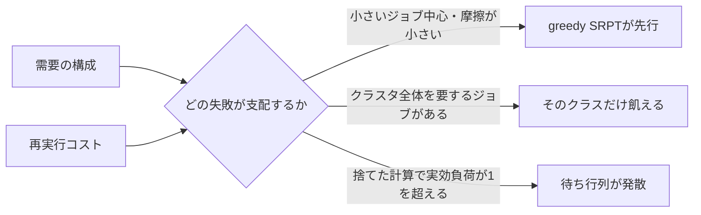

<p class="research-area"><b>GPUクラスタのスケジューリング</b><span>この研究系列の出発点（EP-0001）</span><a href="/en/research/gpu-scheduling/" hreflang="en">English</a></p>

<div class="evidence-strip"><span>Finding</span><span>合成シミュレーション</span><span>探索的</span><span>査読なし</span><span>外部再現 0</span></div>

> **この記事の2つの結論は、後続の研究によって条件が付きました。** [[ja/research/gpu-scheduling-phase-diagram/index|EP-0002]]は、下の「推定誤差はあまり効かない」という結論がノイズの与え方に依存すること、そしてgreedy SRPTの結果がクラスタ全体を要するジョブを含まない需要構成に限られることを示しました。[[ja/research/gpu-scheduling-starvation-mechanism/index|EP-0003]]がその原因を切り分けています。この記事は2026-09-13時点で何を主張したかの記録として、書き換えずに残します。

## 現在わかっていること

GPUクラスタのスケジューラは、どのジョブを先に走らせるかを決めます。理論上は、残り処理時間が短いジョブを優先する方式（SRPT系）が平均完了時間を最小にします。ただし実運用には2つの摩擦があります。ジョブの所要時間は正確には分からない（推定誤差）ことと、走っているジョブを中断して入れ替えると、それまでの計算が捨てられる（再実行コスト）ことです。

64スロットの合成クラスタで両方を入れた結果、**常に最善の方式はありませんでした。** 小さいジョブ中心の構成で摩擦が小さいときはgreedy SRPTが先行します。しかし大きいジョブ（32〜64 GPUを同時に要求するもの）が中心になると、greedy SRPTでは待ち行列が発散し、ServerFilling-SRPTが安定を保ちました。

意外だったのは、優劣を決めたのが推定誤差ではなかったことです。**調べた範囲では、推定誤差だけではgreedy SRPTとEASY backfillの順位は入れ替わりませんでした。** 決めたのは再実行コストのほうです。コストが0.2になると、中断のたびに捨てられる計算が積み上がり、実効的な負荷が処理能力を超えて、待ち行列が発散しました。

これは合成シミュレーションの結果であり、実際のクラスタのトレースによる証拠ではありません。実務へ持ち出す前に、上の更新通知と、後続の3本を読んでください。

## 図で見る



## この研究が示すこと

- 宣言したシミュレータの中では、方式の優劣が需要の構成と再実行コストに依存して入れ替わる。
- 封印した10本の予測は7本が的中し、外れた予測と判定不能だった予測も記録として残してある。

## この研究が示さないこと

- 現在の実クラスタで境界がどこにあるかは示しません。この問いは後にEP-0004が測りました。
- 運用環境での優越性、公平性、普遍的な交点の存在は確立しません。

## なぜ重要か

平均完了時間だけを見ると、ある方式は安定していて別の方式は特定のジョブクラスを飢餓させ待ち行列を溜め続けている、という差が隠れます。実運用のスケジューラは所要時間の推定に不確実性を抱え、中断・再開のコストも負います。理想条件での順位を、安定性の境界なしにそのまま持ち込むことはできません。

## 何を調べたか

所要時間の推定誤差 `σ` と再実行コスト `c_pre` は、greedy SRPTおよびServerFilling-SRPTと、FCFS＋EASY backfillの順位をどこで入れ替えるか。その境界は、GPU需要の構成にどう依存するか。

## 競合仮説

- **H1 — 理論は頑健：** 調べた推定誤差の範囲では、サイズ優先の方式が有用なままである。
- **H2 — 情報に脆い：** 推定誤差だけで順位が入れ替わる。
- **H3 — 再実行コストが支配的：** 捨てられる計算が実効負荷を変え、安定性を逆転させる。
- **H4 — 需要の構成が支配的：** 大きいジョブによる断片化と飢餓によって、使える原理そのものが変わる。

## 事前に固定した予測

E1を実行する前に10本の予測を封印しました。封印とは、結果を見る前に予測文と判定基準を確定し、ハッシュで固定することです。予測JSONのSHA-256は `dd977a92c0edf7472a6190d35dab7baa22743375627ca326be354d4c4eda4b01` で、結果ファイルがまだ存在しないコミット `a66c492` に固定してあります。

| 予測 | 判定基準 | 結果 |
|---|---|---|
| P1 | `sigma=1,c=0` でSRPT/EASYの平均JCT比 < 0.95 | 的中：0.659 |
| P2 | `sigma=2,c=0` でもSRPTがEASYに勝つ | 的中：0.909 |
| P3 | `c=0.2,sigma=0` でSRPTがEASYに負ける | 的中：SRPTが発散 |
| P4 | 交点は `c=0.05` と `0.2` の間 | 的中：0.794の後に発散 |
| P5 | 大ジョブ中心・`c=0.2` でServerFilling-SRPTがSRPTに勝つ | 的中：比0.129 |
| P6 | 全セルでServerFilling/SRPTの捨てた計算量の比 > 1.5 | **外れ：** 1セルは1.25 |
| P7 | 大ジョブ中心なら、推定誤差によるServerFilling-SRPTの悪化が小さい | **外れ／判定不能：** 基準のSRPTが全セルで発散 |
| P8 | `sigma=0` から `2` でEASYの変化は15%未満 | **外れ：** 16.2%、しかも単調でない |
| P9 | FCFSは使っていない摩擦パラメータに影響されない | 的中：偏差0.00% |
| P10 | 大ジョブ中心のFCFSは全セルで待ち行列が増える | 的中：4/4 |

採点は**10本中7本的中**です。P7からは設計上の欠陥も分かりました。性能の劣化を予測する前に、比べる両方の系が安定していることを要求すべきでした。

## 方法

- 同一のGPUサーバスロット64個。大きいジョブは複数スロットを同時に要求します。
- サービス時間は平均1.0の指数分布、提供負荷 `rho=0.85`。
- 各セル30,000ジョブ、最初の20%は暖機として除外、シードは固定の5本。
- 方式：FCFS、EASY backfill、greedy SRPT、ServerFilling-SRPT。
- `sigma ∈ {0, 0.5, 1, 2}`、`c_pre / E[S] ∈ {0, 0.05, 0.2}`。
- 合成の需要構成を2種類。1GPUジョブ中心の構成は内部IDを `trace_like` とし、もう一方の `gang_heavy` は32/64 GPUジョブ中心です。`trace_like` という名前は、実トレースを使ったという意味ではありません。
- E1は320回の実行。観測長を延ばして裁定し、安定した待ち行列と増え続ける待ち行列を区別しました。

E1の前に、M/M/c、Little's law、仕事量保存、プール化SRPTの下界、ServerFillingの選択規則でシミュレータを検算しています。

## 結果

### 需要の構成で、勝つ原理が変わった

小さいジョブ中心の合成構成（内部ID `trace_like`）でコスト0のとき、`sigma=0` のgreedy SRPTの平均JCTは1.13で、ServerFilling-SRPTの1.35、EASYの1.58より小さくなりました。`sigma=2` でもgreedy SRPTは1.20対1.33でEASYより優位でした。

`gang_heavy` で摩擦0のときはgreedy SRPTが発散し、ServerFilling-SRPTは平均JCT 3.54で安定しました。greedy SRPTでの64 GPUジョブの平均JCTは71.5で、8 GPUジョブのおよそ48倍です。ServerFilling-SRPTではクラス間の順位が逆転し、64 GPUジョブは2.3でした。

### 再実行コストは、平均遅延ではなく安定性を変えた

同じ小さいジョブ中心の構成では、greedy SRPTのジョブあたり中断回数が、コスト0の0.62からコスト0.2の1.99へ増えました。捨てられる計算は40%に達し、`rho_eff = 0.85 × (1 + 0.40) = 1.19` となって、観測長を延ばしても待ち行列の増加が止まりませんでした。この構成では、ServerFilling-SRPTもコスト0.2で実効的な処理能力を超えました。


## 何が変わったか

- 「理論上最適なサイズ優先の方式を使う」という規則を捨てました。優位性は需要の構成と摩擦に条件付きでした。
- 調べた格子の中では、「推定誤差が主な弱点」という説を採用しませんでした。実際に測れた故障の仕組みは再実行コストでした。
- 全体の使用率がほぼ1のまま特定クラスの飢餓が共存するため、使用率の飽和だけを安定性の境界として扱うのをやめました。

## 何が失敗したか

E1の前に、シミュレータと解析の欠陥を3つ見つけました。

1. 中断されたジョブが待ち行列から消えてしまい、平均JCTが不当に良く見えていた。
2. 「FCFSは使用率が低いはずだ」という較正規則は、安定して仕事量を保存する系では概念的に誤りだった。
3. 到着が止まれば有限の系は必ず捌けきるので、完了率では発散を判定できない。

外れた予測P6〜P8も公開記録として残します。P7は発散のもとで基準そのものが無効になった例、P8は選んだ対数正規のパラメータ化と絡んでいる可能性がある非単調な応答です。

## 証拠の範囲

**言えること：** 指定したシミュレータ、需要構成、パラメータ格子、シードの範囲で、需要の構成と再実行コストが方式の順位を変え、複数のセルが安定から発散へ移り、封印した予測は10本中7本が的中した。

**言えないこと：** 運用クラスタでの優位、普遍的な交点、任意の所要時間分布に対する頑健性、公平性の許容判断、外的妥当性。Blox、Philly、Alibaba PAIなどの実トレースはこの研究では使っていません。

## まだ分からないこと

- `sigma=2` を超える領域に、推定誤差だけによる交点があるか。
- 平均を合わせるのではなく中央値を合わせた対数正規の誤差でも、結果が保たれるか。
- 大きいジョブの割合と再実行コストによる、連続的な交点の曲線。
- 指数分布でない所要時間、相関した推定、チェックポイント、配置制約のもとでの挙動。
- 実トレースでの検証。

## この結論が崩れるとき

- 同じパラメータで、独立に実装したシミュレータや実機のシミュレータが、安定・発散の分類を再現しない。
- 発散と判定したセルで、観測長を延ばすと待ち行列の増加率が0へ近づく。
- 中央値を合わせた誤差モデルに直すと、同じ範囲の推定誤差についての推論が逆転する。
- 代表的な実トレースで、構成依存の順位や飢餓の向きが再現されない。

## 自分で確かめる

### データと較正の簡易確認

```bash
python -m pip install -r requirements-reproduce.txt
python scripts/reproduce.py --quick gpu
```

### E1全体の再実行

```bash
cd reproduction/gpu-scheduling
python run_sweep.py
python analyze_e1.py
```

公開パッケージはE1の結果コミット `6e96d5f` に固定しています。非公開リポジトリ側にある、まだ裁定していない後続実験は意図的に含めていません。

## 証拠とデータ

- [公開再現パッケージ](https://github.com/kbmt327-dev/scientific-os-research/tree/main/reproduction/gpu-scheduling)
- [封印済みPRED-001](https://github.com/kbmt327-dev/scientific-os-research/blob/main/reproduction/gpu-scheduling/predictions/PRED-001.json)
- [E1の採点](https://github.com/kbmt327-dev/scientific-os-research/blob/main/reproduction/gpu-scheduling/results/E1_grading.json)
- [E1の結果データ](https://github.com/kbmt327-dev/scientific-os-research/blob/main/reproduction/gpu-scheduling/results/E1.json)
- 内部の元Episodeのハッシュ：`c72f32f1b4269cf761083cb646ae7cd15d7a82b1a3f4c37a678739094098f1a0`

## 外部からの検証

- 独立再現：0
- 再現失敗：0
- 公開後に確認されたbug：0
- 未解決の批判：0

## 次の実験

中央値を合わせた誤差モデルを使って、大きいジョブの割合と再実行コストを細かく掃引し、事前に登録した代表点を公開の運用トレースで検査します。平均JCTを比べる前に、安定していることを必要条件とします。
