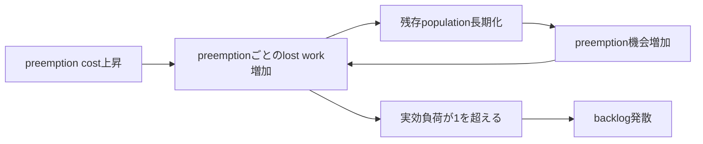

<p class="language-switch">English: <a href="/scientific-os-research/research/gpu-scheduling/">Original Research Note</a></p>

<div class="evidence-strip"><span>Finding</span><span>合成simulation</span><span>探索的</span><span>peer reviewなし</span><span>外部再現 0</span></div>

## 要約

job sizeの推定に誤差があり、preemptionで処理済みworkが失われるとき、size-based GPU schedulingがFCFSやEASY backfillに負ける境界を調べました。64 serverの合成multi-server-job simulatorではworkload mixが結果を質的に変え、小job中心では摩擦が小さいとgreedy SRPTが優位でしたが、large gang中心では発散し、ServerFilling-SRPTは安定しました。検査範囲では推定誤差だけでgreedy SRPTとEASYの順位は逆転せず、preemption cost 0.2で実効負荷がcapacityを超え発散しました。これはsimulation結果であり、production traceの証拠ではありません。

## 研究質問

size推定誤差`σ`とpreemption cost `c_pre`は、greedy SRPTおよびServerFilling-SRPTと、FCFS＋EASY backfillの順位をどこで逆転させるか。その境界はGPU demand mixにどう依存するか。

## なぜ重要か

平均完了時間だけでは、一つのpolicyが安定している一方で別のpolicyが特定demand classを飢餓させ、backlogを蓄積する差を隠します。実運用schedulerにはsize推定の不確実性とrestart/checkpoint costがあるため、理想条件の順位をstability boundaryなしで移植できません。

## 競合仮説

- **H1 — theory robust:** 検査した推定誤差の範囲ではsize-based priorityが有用。
- **H2 — information fragile:** 推定誤差だけで順位が逆転する。
- **H3 — preemption-cost dominant:** 失われるworkが実効負荷を変え、安定性を逆転させる。
- **H4 — mix dominant:** large gang demandのfragmentation／starvationにより、使えるscheduling principleが変わる。

## 予測

E1の前に10予測をsealしました。Prediction JSONのSHA-256は`dd977a92c0edf7472a6190d35dab7baa22743375627ca326be354d4c4eda4b01`で、結果artifactが存在する前のsource commit `a66c492`に固定されています。

| 予測 | 判定基準 | 結果 |
|---|---|---|
| P1 | `sigma=1,c=0`でSRPT/EASY平均JCT < 0.95 | 支持：0.659 |
| P2 | `sigma=2,c=0`でもSRPTがEASYに勝つ | 支持：0.909 |
| P3 | `c=0.2,sigma=0`でSRPTがEASYに負ける | 支持：SRPT発散 |
| P4 | crossoverは`c=0.05`と`0.2`の間 | 支持：0.794の後に発散 |
| P5 | gang-heavy、`c=0.2`でServerFilling-SRPTがSRPTに勝つ | 支持：比0.129 |
| P6 | 全friction cellでServerFilling/SRPT lost-work比 > 1.5 | **失敗：** 1 cellは1.25 |
| P7 | gang-heavyで推定誤差によるServerFilling-SRPTの悪化が小さい | **失敗／判定不能：** 基準SRPTが全cellで発散 |
| P8 | `sigma=0`から`2`でEASYの変化は15%未満 | **失敗：** 16.2%、非単調 |
| P9 | FCFSは未使用friction parameterに不変 | 支持：偏差0.00% |
| P10 | gang-heavy FCFSのbacklogが全cellで増加 | 支持：4/4 |

採点は**7/10支持**です。P7から、performance degradationを予測する前に両systemの安定性を要求すべきという設計上の欠陥も分かりました。

## 方法

- 64個の同一GPU server slot。multi-server jobは複数slotを同時要求。
- service durationは平均1.0の指数分布、offered load `rho=0.85`。
- 各cell 30,000 job、warm-up 20%、固定seed 5本。
- Policy：FCFS、EASY backfill、greedy SRPT、ServerFilling-SRPT。
- `sigma in {0,0.5,1,2}`、`c_pre / E[S] in {0,0.05,0.2}`。
- 2つの合成demand mix。1-GPU job中心のsmall-job-heavy mixは内部scenario IDを`trace_like`とし、もう一方の`gang_heavy`は32/64-GPU job中心。`trace_like`という名称はproduction traceを使用したという意味ではありません。
- E1は320 run。長horizonの裁定で安定queueと増加backlogを分離。

E1前にM/M/c、Little's law、work conservation、pooled-SRPT lower bound、ServerFilling選択規則でsimulatorを検算しました。

## 結果

### Mixで勝つ原理が変わった

small-job-heavyな合成mix（内部ID `trace_like`）かつcost 0では、`sigma=0`のgreedy SRPT平均JCTは1.13で、ServerFilling-SRPT 1.35、EASY 1.58より小さくなりました。`sigma=2`でもgreedy SRPTは1.20対1.33でEASYより優位でした。

`gang_heavy`かつ摩擦0ではgreedy SRPTが発散し、ServerFilling-SRPTは平均JCT 3.54で安定しました。greedy SRPTの64-GPU job平均JCTは71.5で、8-GPU jobの約48倍でした。ServerFilling-SRPTではclass順位が逆転し、64-GPU jobは2.3でした。

### Preemption costは平均遅延だけでなく安定性を変えた

同じsmall-job-heavyな合成mixでは、greedy SRPTのjob当たりpreemptionがcost 0の0.62からcost 0.2の1.99へ増えました。lost workは40%に達し、`rho_eff = 0.85 * (1 + 0.40) = 1.19`となり、長horizonでもbacklog slopeは縮みませんでした。このmixではServerFilling-SRPTもcost 0.2で実効capacityを超えました。



## 何が変わったか

- 「理論上optimalなsize-based policyを使う」という規則を捨てました。優位性はdemand mixとfrictionに条件付きでした。
- 検査grid内では「size推定誤差が主な弱点」を採用しませんでした。測定された故障mechanismはpreemption costでした。
- class starvationがaggregate utilization約1と共存するため、飽和utilizationだけをstability boundaryとして扱うのをやめました。

## 何が失敗したか

E1前に3つのsimulator／analysis defectを検出しました。

1. preemptされたjobがwaiting setから消え、平均JCTが不当に良く見える。
2. 「FCFSは低utilizationでなければならない」という較正规則は、安定したwork-conserving systemでは概念的に誤り。
3. arrival停止後に有限systemがdrainするため、completion fractionでは発散を判定できない。

失敗予測P6–P8も公開recordに残します。P7は発散下で基準が無効、P8は選んだlognormal parameterizationと絡む可能性のある非単調応答を示しました。

## 証拠境界

**支持されること：** 指定したsimulator、demand mix、parameter grid、seedの範囲で、workload mixとpreemption costがpolicy順位を変え、複数cellが安定から発散へ変化し、sealed predictionは7/10支持された。

**支持されないこと：** production clusterでの優位、普遍的crossover、任意のduration分布への頑健性、fairnessの許容性、外的妥当性。Blox、Philly、Alibaba PAIその他の実traceは未実行です。

## UNKNOWN

- `sigma=2`を超える領域に推定誤差だけのcrossoverがあるか。
- mean-unbiasedではなくmedian-unbiasedなlognormal errorでも結果が維持されるか。
- large-gang shareとpreemption costの連続crossover contour。
- 非指数duration、相関した推定、checkpoint、placement constraintでの挙動。
- 実traceでの検証。

## 反証条件

- 同一parameterの独立simulator／実simulatorで安定・発散分類を再現できない。
- 発散としたcellのbacklog slopeが長horizonで0へ近づく。
- 修正したmedian-unbiased error modelで同じ範囲の推定誤差に関する推論が逆転する。
- 代表的な実traceでmix依存の順位またはstarvation方向が再現されない。

## 再現

### Quick artifact／較正check

```bash
python -m pip install -r requirements-reproduce.txt
python scripts/reproduce.py --quick gpu
```

### E1全体のrerun

```bash
cd reproduction/gpu-scheduling
python run_sweep.py
python analyze_e1.py
```

公開packageはE1 result commit `6e96d5f`に固定しています。private source repositoryの後続未裁定実験は意図的に含めていません。

## 証拠 / Artifacts

- [公開reproduction package](https://github.com/kbmt327-dev/scientific-os-research/tree/main/reproduction/gpu-scheduling)
- [Sealed PRED-001](https://github.com/kbmt327-dev/scientific-os-research/blob/main/reproduction/gpu-scheduling/predictions/PRED-001.json)
- [E1 grading](https://github.com/kbmt327-dev/scientific-os-research/blob/main/reproduction/gpu-scheduling/results/E1_grading.json)
- [E1 result data](https://github.com/kbmt327-dev/scientific-os-research/blob/main/reproduction/gpu-scheduling/results/E1.json)
- 内部source Episode digest：`c72f32f1b4269cf761083cb646ae7cd15d7a82b1a3f4c37a678739094098f1a0`

## 外部監査

- 独立再現：0
- 再現失敗：0
- 公開後に確認されたbug：0
- 未解決critique：0

## 次の実験

median-unbiased error modelを用いてlarge-gang shareとpreemption costを細かく掃き、事前登録した代表点をpublic production traceで検査します。平均JCTを比較する前に安定性を必要条件とします。
