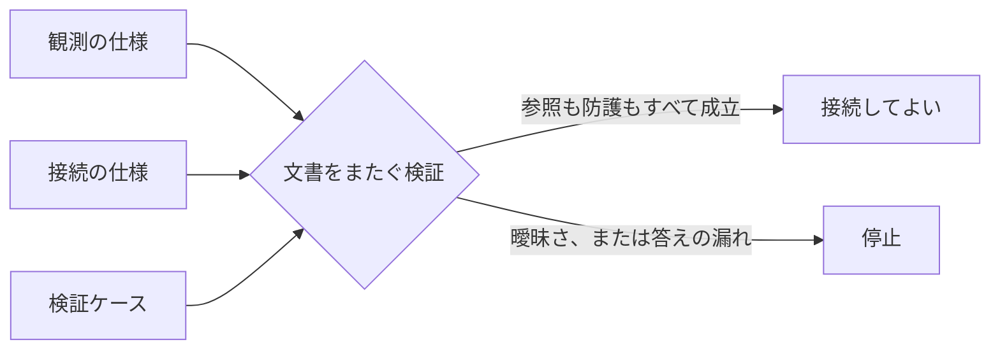

<p class="research-area"><b>人体運動モデルのデータ接続</b><span>数値を解釈する前に、接続の前提を機械が検査できるようにする</span><a href="/en/research/human-model/" hreflang="en">English</a></p>

<div class="evidence-strip"><span>Method</span><span>仕様適合の検証</span><span>接続部は停止中</span><span>予測性能の証拠ではない</span><span>外部再現 0</span></div>

## この方法がすること

計測した人体の動きをモデルへ渡すとき、座標系の取り違え、対応づけの未解決、参照先の欠落、答えを入力に混ぜてしまう漏れ（リーク）が起きます。従来これらは文章上の注意書きで扱われ、読み飛ばされれば通ってしまいました。

Human Model Contract v0.2は、これらを**機械が検査できる要件に変換し、満たされないときは処理を止めます**。警告を出して先へ進むのではなく、止めます。

正しく作った一式は9種類の検査すべてに合格しました。意図的に壊した7つの変種は、すべて拒否されました。

この方法が保証するのは**接続の前提が明示され、破られたら止まること**だけです。数値変換の正しさや、人体モデルの予測性能は、まったく別の話です。実際、公開している例では座標の食い違いが未解決のままなので、接続部は**停止したまま**にしてあります。

## 図で見る



## この方法が保証すること

公開しているスキーマ一式は、宣言した参照関係、接続してよいかの判定、そして不正例の拒否を実際に強制します。

## この方法が保証しないこと

数値変換、バイオメカニクスの予測、科学的な価値、モデルの昇格は検証しません。公開している接続部は停止したままです。

## なぜ重要か

人体モデルの処理系は、座標系、モデルの基準姿勢、処理の段階、そして本来は出力であるはずの量を、混ぜたまま動いているように見えることがあります。数値の性能を解釈する前に、その境界違反を仕組みの側が明示すべきです。

## 何を調べたか

公開されているバイオメカニクスのサンプルにある既知の食い違いを、「対応づけの未解決」「座標系の曖昧さ」「参照の欠落」「答えの漏れ」として表現し、文章上の注意ではなく機械が検証ケースを止める形にできるか。

## 方法

公開している一式は次の3つを定義します。

- **観測の仕様（ObservationSpec）：** 座標空間、チャネル、処理の段階、出所の整合性検査、構造化した警告。
- **接続の仕様（AdapterSpec）：** 元になる観測、対象モデル、座標・基準姿勢の参照、対応づけの状態、確認済みの警告。
- **検証ケース（ValidationCase）：** 観測・モデル・接続の正確な参照、入力、目標値、漏れの規則、接続してよいかの状態。

検証プログラムは、JSON Schema 2020-12への適合、識別子の一意性、文書をまたぐ参照、接続先、出所の警告、漏れの規則、接続可否の判定を検査します。

## 結果

基準の一式は9つの検査グループに合格しました。次の7つの不正例はすべて拒否されました。

1. `coordinate_spaces` が欠けている。
2. 未知のチャネル座標を参照している。
3. `adapter_ref` が欠けている。
4. 接続の仕様と検証ケースで、元になる観測が食い違っている。
5. 出所の不整合を示す警告が削除されている。
6. 対応づけが未解決なのに `ready` にしている。
7. 力学・外力から導かれた目標チャネルを入力に入れている。

## 何が変わったか

v0.1のファイルを上書きするやり方から、版を分けたv0.2のスキーマと例へ移しました。これにより過去のデータのハッシュが保たれ、意味の変更を後から監査できます。

## 何が失敗したか

元のサンプルで、実際に動く自由度が37なのに、埋め込まれている座標が39という食い違いが見つかりました。この仕組みは不整合を記録できますが、どちらが正しいかは決められません。そのため公開している例は、曖昧さを接続の主張に変換せず、**停止したまま**にしてあります。

## 証拠の範囲

**言えること：** 同梱した公開スキーマ、例、文書をまたぐ検証プログラム、不正例が、宣言した規則を実際に強制する。

**言えないこと：** Nimble/OpenSimの実行、B3Dの数値的なフレーム変換、37自由度から18自由度への対応づけの正しさ、バイオメカニクスの予測、科学的な価値、モデルの昇格。

## まだ分からないこと

- 同じB3Dの中身を、公式のNimble APIと、調査したprotobuf経路とで一貫して読めるか。
- 実際に動く自由度の数と、埋め込まれた座標の数、どちらが正しいか。
- フレームや基準姿勢の変換が数値的に妥当か。
- ラケットの状態を落とさずに、対象モデルへ有効な対応づけを作れるか。

## この結論が崩れるとき

- 下記の不正例のいずれかを受理してしまう。
- `ready` な検証ケースが、未解決の接続を参照できてしまう。
- 目標由来の力学チャネルを拒否せず、入力に入れられてしまう。
- 公式APIの調査結果が、公開されている出所のメタデータや座標の前提と矛盾する。

## 自分で確かめる

```bash
python -m pip install -r requirements-reproduce.txt
python scripts/reproduce.py --quick human
```

公開している一式はプライバシー処理済みです。内部の例に含まれていたローカル環境の文書パスを、リポジトリ相対の参照へ変換しました。検証プログラムと科学的な境界は変えておらず、公開データのハッシュは別に記録しています。

## 証拠とデータ

- [スキーマ、例、検証プログラム、証拠](https://github.com/kbmt327-dev/scientific-os-research/tree/main/reproduction/human-model-contract)
- 内部の元Episodeのハッシュ：`260f10d6b70d75420e9aa57945ca24cd7d0335eaed053cf5a0fe9f77008f90f8`

## 外部からの検証

- 独立再現：0
- 再現失敗：0
- 公開後に確認されたbug：0
- 未解決の批判：0

## 次の実験

同じ公開B3Dデータを公式のLinux/Nimble環境で読み、ヘッダ、試行、処理段階、フレーム、欠測している外力のメタデータを、現在の抽出結果と比較します。必要な対応づけが一つでも未解決なら、接続部は停止したままにします。
